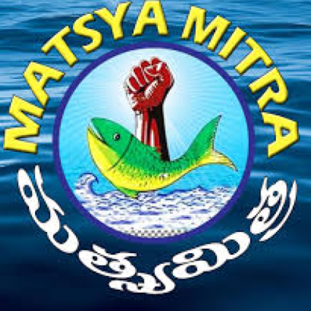
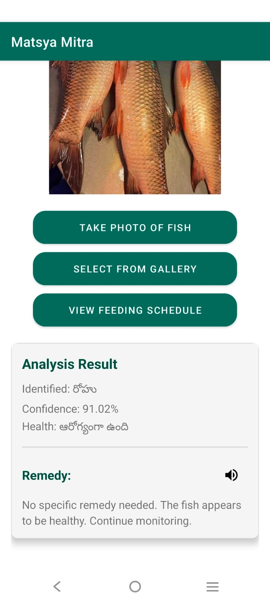
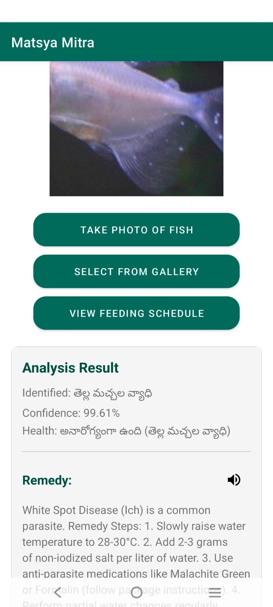

#  Matsya Mitra (మత్స్య మిత్ర) 🐟

**Matsya Mitra** (Fisherman's Friend) is an AI-powered Android application designed to empower fish farmers with digital tools for better aquaculture management. 

---

## 🚀 Key Features

### 🔍 AI Fish Identification
Instantly identify common fresh-water fish species:
- **Catla**
- **Rohu**
- **Tilapia**

### 🩺 Disease Diagnosis & Remedy
Identify symptoms of common fish ailments through photo analysis:
- **White Spot Disease (Ich)**
- **Fin Rot**
- Provides detailed, actionable treatment steps based on aquaculture best practices.

### 📅 Feeding Schedule Manager
Keep track of daily feeding routines:
- Register fish species, feed amount, and daily timings.
- Persistence data ensures schedules are saved even after closing the app.

### 🔊 Audio Assistance (Telugu)
Built-in **Text-To-Speech** support in **Telugu** to help farmers who may struggle with reading English instructions.

---

---

## 📺 Demo
Check out the app in action:

**[Watch the full Demo on Google Drive](https://drive.google.com/file/d/1Bvpqu1US76WX7BwOAsRX0Y3Eiwrx3ia5/view?usp=drivesdk)**

---

## 🛠 Tech Stack

- **Languge**: Kotlin
- **Framework**: Android SDK
- **AI Engine**: TensorFlow Lite (TFLite)
- **Model Training**: Trained using **[Google Teachable Machine](https://teachablemachine.withgoogle.com/)** with custom datasets for fish species and diseases.
- **Speech**: Android TTS Engine
- **Storage**: SharedPreferences for lightweight persistence

---

## 📸 Screenshots

  
  

*Left: Healthy Rohu identification. Right: White Spot Disease detection.*

---

## 🛠 Installation & Usage

1. Clone this repository.
2. Open the project in **Android Studio**.
3. Build and run on an Android device (API 31+ recommended).
4. Use the "Take Photo" button to analyze a fish or "View Feeding Schedule" to manage your routines.

---

## 📜 License
This project is for educational and practical support for aquaculture.
